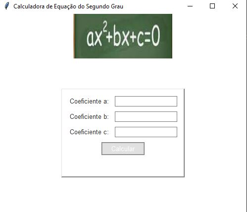
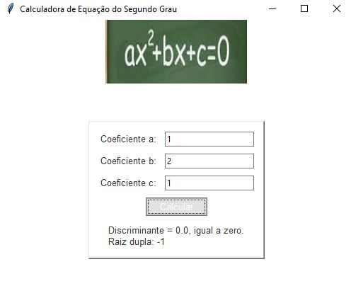

# Calculadora de Equação do Segundo Grau

Este script implementa uma calculadora simples para resolver equações do segundo grau, também conhecidas como equações quadráticas. Utilizando a biblioteca Tkinter em Python, proporciona uma interface gráfica intuitiva para inserir os coeficientes \( a \), \( b \), e \( c \) da equação \( ax^2 + bx + c = 0 \), calculando e exibindo as raízes correspondentes.

## Funcionalidades

1. **Entrada de Coeficientes:** Fornece campos de entrada para os coeficientes \( a \), \( b \), e \( c \) da equação quadrática.
2. **Cálculo de Raízes:** Após a inserção dos coeficientes, o botão "Calcular" executa o cálculo das raízes da equação.
3. **Exibição de Resultados:** Exibe as raízes da equação, considerando diferentes casos: raízes reais distintas, raiz real única (raiz dupla), ou raízes complexas conjugadas.
4. **Validação de Entrada:** Realiza validação para garantir que apenas números válidos sejam inseridos nos campos de entrada.
5. **Interface Gráfica Atraente:** Utiliza imagens para representar a equação quadrática e implementa um tema visual escuro para a interface, tornando-a esteticamente agradável e de fácil utilização.

## Instruções de Uso

1. Insira os coeficientes \( a \), \( b \), e \( c \) nos campos de entrada correspondentes.
2. Clique no botão "Calcular" para obter as raízes da equação.
3. Os resultados serão exibidos abaixo do botão de cálculo, indicando as raízes encontradas ou mensagens de erro em caso de entrada inválida.

## Instruções de Instalação

1. Certifique-se de ter Python instalado em seu sistema.
2. Instale as bibliotecas necessárias utilizando pip:
pip install pillow
3. Baixe o script `equacao_quadratica.py`.
4. Execute o script Python utilizando o comando:
python equacao_quadratica.py

## Requisitos do Sistema

- Python 3.x
- Tkinter
- PIL (Python Imaging Library)

Este script oferece uma maneira simples e eficaz de calcular as raízes de equações do segundo grau, sendo útil tanto para estudantes quanto para profissionais que trabalham com problemas que envolvem equações quadráticas.

## Screenshots

